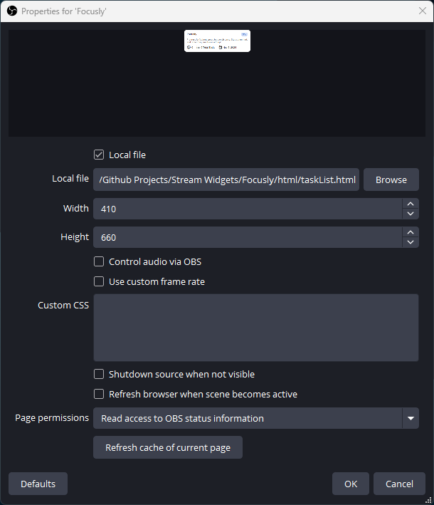
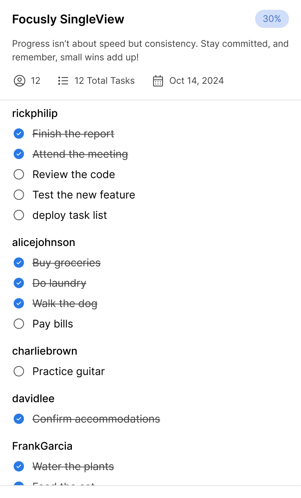
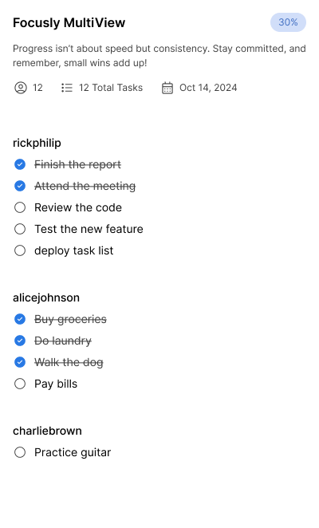
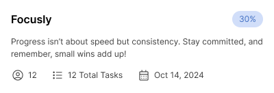
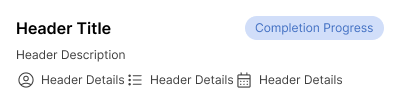

[](https://buymeacoffee.com/kimothorick)

# STATUS: IN DEVELOPMENT

# Focusly - Twitch Task Bot

Focusly is a task management bot for Twitch streamers and viewers, designed for coworking and studying in real time.
With Focusly, you can manage tasks, track progress, and stay organized during streams without needing external tools. It
uses a simple, customizable overlay for task management, allowing viewers to interact and stay productive.

## Features

- 📝 Task Management: Add, edit, remove, finish, and view tasks.
- 🎨 Customizable UI: Set your task list’s appearance, fonts, and layout.
- 🎮 Commands for Streamers and Viewers: Different commands for managing tasks, progress, and more.
- 🔧 Admin Control: Moderators can delete tasks or clear task lists.
- ⏱️ Real-time Task Updates: Streamers and viewers can interact with the task list in real time.

## Getting Started

### Prerequisites

1. **Twitch Account**:  
   You can use your existing Twitch account or create a new one specifically for the bot.


2. **OAuth Token**:  
   Generate an OAuth token to allow the bot to connect to Twitch.
    - Visit the [Twitch Chat OAuth Password Generator](https://twitchapps.com/tmi/).
    - Log in with your chosen account and generate an OAuth token.
    - Copy the token provided; you’ll need this for the bot configuration.

### Setup

1. **Download the Repository**  
   [Download the repository as a ZIP file](https://codeload.github.com/kimothorick/Focusly/zip/refs/heads/main) and
   extract it to your preferred
   location on your computer.


2. **OBS Setup**
    - Add a browser source to your desired scene and name it whatever you want.
    - In the properties, choose Local file and locate the `taskList.html` file from the repository you downloaded and
      extracted as instructed above.
    - Set the `width to 410` and `height to 660`.  
      After all that, your properties should be similar to this:  
      

### Channel Configuration

Open the `config.js` file in the `js folder` and set up the following details:

```javascript
const channel = '';   // Insert your Twitch channel name here
const username = '';  // Insert your bot’s account username here
const oauth = '';     // Insert your bot’s OAuth token here
```

Once completed,it should look like:

```javascript
const channel = 'gamer123';  // Insert your Twitch channel name here 
const username = 'yourBotUsername';  // Insert your bot’s account username here
const oauth = 'oauth:yourOAuthTokenHere';  // Insert your bot’s OAuth token here
```

Once these steps are completed, your bot is ready to connect.
For customization options like **Appearance** and **Theming**, refer to the next sections.

### Enable Testing

To enable testing, set the `testingMode` value to `true` to use dummy data. This is useful for testing the bot's
functionality and appearance before going live.

To enable testing mode, open the `config.js` file and change the following line:

```javascript
// Enable to use dummy data, set false to remove dummy data and true to fill with dummy data
const testingMode = true;
```

If you wish to disable testing mode and remove the dummy data, set the value to false:

```javascript
// Enable to use dummy data, set false to remove dummy data and true to fill with dummy data
const testingMode = false;
```

> **IMPORTANT**  
> Remember to set testingMode to false before going live to ensure the bot uses real data instead of dummy content
> during operation.

### Commands
This section is long; hence, to make it easier, there are toggles to make it readable.

<details>
<summary>All Commands</summary>

Below is a list of all commands available in the Focusly bot. Each command has specific formats that must be used
exactly as shown.

#### *1. Add Tasks Command*

Adds a new task to the list. When adding multiple tasks, you separate them with a `;`

```javascript
// Add Task Commands
const addTaskCommands = ['taskadd', 'addtask', 'task', 'add'];
```

**Usage Example**:
> For one task: `!task Write this example for one task`  
> For multiple tasks: `!task Write this example; cleanup code; review code`

#### *2. Edit Task Command*

Edits an already existing task.

```javascript
// Edit task - use commands in this exact format
const editTaskCommands = ['taskedit', 'edittask', 'edit'];
```

Usage Example:
> `!edit 2 Write this example for edit task`

#### *3. Set Current Task Command*

Sets the current task you're working on.

```javascript
// Set current task - use commands in this exact format
const setCurrentTaskCommands = ['now'];
```

Usage Example:
> `!now 6`

#### *4. Check Current Task Command*

This returns the user's current task.

```javascript
// Check current task - use commands in this exact format
const checkCurrentTaskCommands = ['current', 'checknow'];
```

Usage Example:
> `!current`

#### *5. Remove Current Task Command*

This removes the user's current task.

```javascript
// Remove current task - use commands in this exact format
const removeCurrentTaskCommands = ['removecurrent'];
```

Usage Example:
> `!removecurrent`

#### *6. Delete Task(s) Command*

This removes selected tasks for a specific user.

```javascript
// Delete task - use commands in this exact format
const deleteTaskCommands = ['taskdel', 'deltask', 'taskdelete', 'deletetask', 'taskremove', 'removetask', 'remove', 'delete'];
```

Usage Example:
> `!taskdel 2,3,4`

#### *7. Delete All Tasks Command*

This removes all the tasks for a specific user.

```javascript
// Delete all tasks - use commands in this exact format
const deleteAllTasksCommands = ['removeall', 'deleteall'];
```

Usage Example:
> `!deleteall`

#### *8. Finish Tasks Command*

This command marks tasks as complete.

```javascript
// Finish task - use commands in this exact format
const finishTaskCommands = ['taskf', 'taskfinish', 'finishtask', 'taskdone', 'finish', 'done', 'finished'];
```

**Usage Example**:
> For one task: `!done 1`  
> For multiple tasks: `!done 1,2,3`

#### *9. Check All Incomplete Tasks Command*

This returns all the selected user's incomplete tasks.

```javascript
 // Check incomplete tasks - use commands in this exact format
const checkIncompleteTasksCommands = ['taskc', 'taskcheck', 'ctask', 'checktask', 'mytasks', 'check', 'tasks'];
```

Usage Example:
> `!mytasks`

#### *10. Check all Tasks Command*

This returns all the selected user's tasks both complete and incomplete.

```javascript
// Check all tasks (upcoming feature) - use commands in this exact format
const checkAllTasksCommands = ['alltasks'];
```

Usage Example:
> `!alltasks`

#### *11. Help Command*

This returns a response with instructions on how to use the bot.

```javascript
 // Help commands - use commands in this exact format
const helpCommands = ['focusly', 'taskh', 'taskhelp', 'helptask'];
```

Usage Example:
> `!focusly`
</details>

<details>
<summary>Admin(Moderator) Commands</summary>

### Admin(Moderator) / Broadcaster Commands

Below is a list of all commands available for moderators and the broadcaster.

#### *1. Admin - Delete All Tasks From A Specific User Command*

This allows the admin to remove all tasks from a selected user.

```javascript
// Admin delete task - use commands in this exact format
const adminDeleteCommands = ['taskadel', 'adel', 'adelete', 'admindelete'];
```

Usage Example:
> `!admindelete @username`

#### *2. Admin - Clear All Tasks Command*

This allows the admin to clear all tasks from a list.

```javascript
// Admin clear all tasks - use commands in this exact format
const adminClearTaskListCommands = ['admindeleteall'];
```

Usage Example:
> `!admindeleteall`

#### *3. Admin - Clear All Completed Tasks Command*

This allows the admin to clear all tasks from the task list.

```javascript
// Admin clear completed tasks only - use commands in this exact format
const adminClearDoneCommands = ['aclear', 'adminclear', 'clearadmin', 'taskaclear'];
```

Usage Example:
> `!adminclear`

#### *4. Admin - Reset Counter Command*

This allows the admin to reset all the counters in the header.

```javascript
// Admin reset task counters - use commands in this exact format
const adminResetCounterCommands = ['resetcounters'];
```

Usage Example:
> `!resetcounters`


</details>

### Customize Appearance

To adjust the look and feel of the bot overlay, open the `config.js` file in the `js` folder and modify the following
appearance settings as desired.

#### Main Appearance Settings

- **Overlay Size**  
  Controls the overall dimensions of the overlay in OBS or other streaming software.
   ```javascript
   const height = '660px';   // Height of the overlay
   const width = '410px';    // Width of the overlay
   ```

- **UI Layout Preferences**  
  These settings adjust the layout and style of the overlay for single-view or multi-view modes.
    - **View Modes**
        <details>
        <summary>Toggle to see the different views.</summary>

          
        </details>

      ``` javascript
      // Layout preference - set true for the view you want and false for the other
      const preferredLayout = {
      singleView: false, // true = single-view, false = multi-view
      multiView: true,   // true = multi-view, false = single-view
      };
      ```
      #### UI Settings for View Modes
      Customize the look of the overlay based on your preferred view mode. Different settings are available for
      single-view and multi-view layouts.

      > **NOTE**  
      Adjust these values to match your desired style. Higher values create more rounded corners, while lower values
      give a sharper, boxy look.

        - **Single-View Mode Settings**  
          For single-view mode, adjust the corner radius of the task list.
          ```javascript
           // When using single-view
           const tasklistCornerRadius = 20;   // Corner radius for the task list in single-view mode
          ```  

        - **Multi-View Mode Settings**  
          In multi-view mode, adjust the corner radius for the header and task container of each for a rounded or
          squared look.

          ```javascript
          const headerCornerRadius = 15;           // Corner radius for header in multi-view mode
          const taskContainerCornerRadius = 15;    // Corner radius for the task container in multi-view mode
          ``` 

- **Task Ordering Style**

     ```javascript
      // Task ordering preference (numbered tasks or checkboxes) - set true for the style you want and false for the other
      const preferredTaskOrdering = {
      numbered: true, // true = ordered tasks, false = checkbox style
      checkbox: false // true = checkbox style, false = ordered
      };
    ```

- **Font Customization**  
  Set your desired font here. It supports all [Google Fonts](https://fonts.google.com/); make sure you name it exactly
  as the website.
    ```javascript
    // Font
    const fontFamily = 'Inter'; // Supports all google fonts - https://fonts.google.com/ - ensure it matches Google Fonts spelling
    ```

- **Header Customization**  
  Set the header title, description, and font style for the header area in the overlay.
  <details>
  <summary> Toggle for header design and structure reference</summary>
    
  </details>

    ```javascript
      // Header details for the bot overlay
      const headerTitleFontSize = 16;   // Font size for header title
      const headerTitleFontWeight = 600; // Font weight for header title
      const completionProgressFontSize = 14; // Font size for completion progress
      const completionProgressFontWeight = 500; // Font weight for completion progress
      const showHeaderDescription = true;  // Set to true to display a header description
      const taskHeaderDescription = "Progress isn’t about speed but consistency. Stay committed, and remember, small wins add up!"  // Customize header description text
      const headerDescriptionFontSize = 13; // Font size for header description
      const headerDescriptionFontWeight = 500; // Font weight for header description
      const headerDetailsFontSize = 14;  // Font size for header details
      const headerDetailsFontWeight = 500;  // Font weight for header details
      const headerDetailsIconSize = 20; // Icon size for header details
    ```

- **Task Display Settings**  
  Customize the appearance of tasks in the overlay, including font size, font weight, color, and completion styling.

    - **Username Settings**  
      Set the font size and weight for usernames displayed in the task list. You can also enable Twitch color to show
      each user’s name in their unique Twitch chat color.

      ```javascript
      const usernameFontSize = 14;            // Font size for usernames
      const usernameFontWeight = 600;         // Font weight for usernames
      const useUserTwitchColor = true;        // Use user's Twitch color for username in task list (true/false)
      ```

    - **Task Text Settings**  
      Adjust the font size and weight for task descriptions. Enable or disable italics for completed tasks to make them
      visually distinct.
      ```javascript
      const taskFontSize = 14; // Font size for tasks
      const taskFontWeight = 500; // Font weight for tasks
      const italicsOnCompletedTask = true; // Set to true to italicize completed tasks
      ```
    - **Checkbox Settings**  
      If you’re using checkbox-style task ordering, adjust the checkbox size to fit your layout.
       ```javascript
       const checkBoxSize = 14;  // Size of checkboxes (applies if checkbox style is enabled)
       ```

> **TIP:**  
> Font weights range from 100 (thin) to 900 (bold). Adjust these to match your preferred visual style.

### Theming

Customize the appearance of your task overlay by selecting or modifying themes to suit your preferred style. Each theme
controls colors for various UI elements, such as backgrounds, text, tasks, and icons.

To configure the theme for your overlay, navigate to the `themeColors.js` in the `js folder` file. Inside, you’ll find
several predefined
themes:

1. Light Theme
2. Pink Theme
3. Black Translucent Theme
4. Custom Theme

Each theme is stored as an object (lightThemeColors, pinkThemeColors, etc.) with customizable color properties. To
select your preferred theme, assign the desired theme object to the preferredThemeColors variable within the same file.
For example, to use the light theme:

```javascript
const preferredThemeColors = lightThemeColors;
```

##### Customizing Your Colors

If you want a unique color scheme, you can use the customThemeColors object to experiment with custom colors. Modify the
values in customThemeColors to create a personalized theme and then set preferredThemeColors to customThemeColors:

```javascript
const preferredThemeColors = customThemeColors;
```

Here are all colors that you can change:

```javascript
// Custom theme colors
const customThemeColors = {
    backgroundColor: '#ffffff', // Background color of the app
    mainColorVariant: '#3F3F3F', // Main color variant for text and elements
    taskCompleteMain: '#329B57', // Color for completed tasks
    taskTextColor: '#000000', // Text color for tasks
    headerBackgroundColor: '#ffffff', // Background color for the header
    userTasksBackgroundColor: '#ffffff', // Background color for user tasks
    headerDescriptionTextColor: '#3F3F3F', // Header description text color
    headerIconColor: '#f8f8f8', // Header icon color
    usernameColor: '#000000', // Username text color
    completedTextColor: '#3F3F3F', // Text color for completed tasks
    checkBoxColor: '#3F3F3F', // Color for checkboxes
    checkSymbolColor: '#ffffff', // Color for checkbox tick symbol
    completedCheckboxColor: '#329B57', // Checkbox color when completed
    completionProgressTextColor: '#4270C3', // Progress text color
    completionProgressBackgroundColor: '#D1DEF9', // Progress background color
    dividerColor: '#E4E4E4', // Divider color between sections
};
```

## Credits
This project is inspired and built on top of the [Task-List](https://github.com/mohamed-tayeh/Task-List)
by [MohFocus](https://www.twitch.tv/mohfocus)  
Author of this project is [Rick Kimotho](https://www.twitch.tv/rickphilip)

    
    
